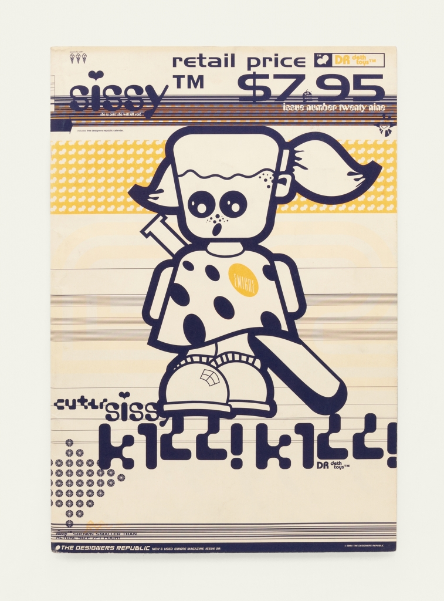

This is a [Next.js](https://nextjs.org/) project bootstrapped with [`create-next-app`](https://github.com/vercel/next.js/tree/canary/packages/create-next-app).

# Ranger
atm, this app functions as a vehicle for presenting artwork collected and..or constructed by myself, and displayed in various contexts within my living space.

## Tron

The first collection of images come from a series of >400 stills I generated from the movie, Tron (1982), a movie I saw in the theater at least 5 times when it was out.

Funny aside, myself and my friends kept getting each of our respective parents to take us all to see the film, so worry not, it wasn't one kid's parents sitting through the film repeatedly (though I'm sure they enjoyed it).

The soundtrack to the construction of this Tron portion of the app comes courtesy of Richie Hawtin and his outstanding 'Decks, Efx & 909' mix from 1999:

https://soundcloud.com/richiehawtin/richie-hawtin-decks-efx-909-01

 

## Ringers

I lifted the Ringers images build out in the project of the same name by Dmitri Cherniak.

https://www.artblocks.io/collections/curated/projects/0xa7d8d9ef8d8ce8992df33d8b8cf4aebabd5bd270/13?section=details

https://twitter.com/dmitricherniak

There are 1000 images I don't remember where exactly I found the images, but I vaguely do remember coding something that grabbed them all for me.

There are multiple ways they're displayed on various pages in Ranger. A single image vs double images set on fixed timers. And a double image layout running on random timers. Pretty happy with the solution I found for that.

Oh, and the layouts work in portrait or landscape, reoriening the presentation with the help of Sass conditionals.

 

## Designers Republic

Mo images

 

# Notes for Future
## Deploy on Vercel

The easiest way to deploy your Next.js app is to use the [Vercel Platform](https://vercel.com/new?utm_medium=default-template&filter=next.js&utm_source=create-next-app&utm_campaign=create-next-app-readme) from the creators of Next.js.

Check out our [Next.js deployment documentation](https://nextjs.org/docs/deployment) for more details.
